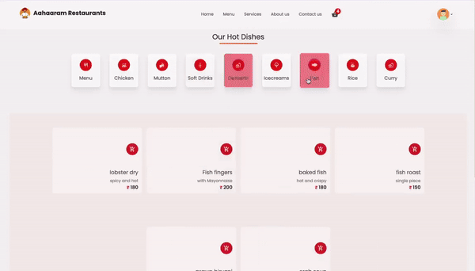

# 𝐀𝐚𝐡𝐚𝐚𝐫𝐚𝐦 𝐒𝐞𝐫𝐯𝐢𝐜𝐞𝐬

Aaharam Restaurant is a full-stack web application built for booking food services. It allows users to browse through various restaurants, view menus, select items, and make reservations.

## Features

- **User Authentication:** Secure user authentication and authorization system to manage user accounts and access.
- **Browse Restaurants:** Users can browse through a list of available restaurants.
- **View Menus:** Detailed menus for each restaurant with item descriptions and prices.
- **Make Reservations:** Users can select items from the menu and make reservations for dining in.
- **Responsive Design:** The application is designed to work seamlessly across various devices and screen sizes.

## Screenshots and Demo

<div align="center">
  
</div>

## Technologies Used

- **Frontend:** React.js, HTML, CSS, JavaScript
- **Backend:** Node.js, Express.js
- **Database:** Firebase
- **Authentication:** JSON Web Tokens (JWT)
- **Deployment:** Vercel

## Getting Started

To get a local copy of the project up and running, follow these steps:

1. Clone the repository:

   ```bash
   git clone https://github.com/your-username/aaharam-restaurant.git
   ```

2. Navigate to the project directory:

   ```bash
   cd aaharam-restaurant
   ```

3. Install dependencies:

   ```bash
   npm install
   ```

4. Set up environment variables:
   
   Create a `.env` file in the root directory and define the following variables:

   ```plaintext
   PORT=3000
   MONGODB_URI=your_mongodb_uri
   JWT_SECRET=your_jwt_secret
   ```

5. Start the development server:

   ```bash
   npm start
   ```

6. Access the application at `http://localhost:3000` in your web browser.

## Contributing

Contributions are welcome! If you'd like to contribute to this project, please fork the repository and submit a pull request with your changes.


## Acknowledgements

- This project was inspired by the need for a simple and intuitive platform for booking food services.
- Special thanks to the developers of React, Node.js, Express.js, and MongoDB for providing the tools and frameworks necessary for building this application.
